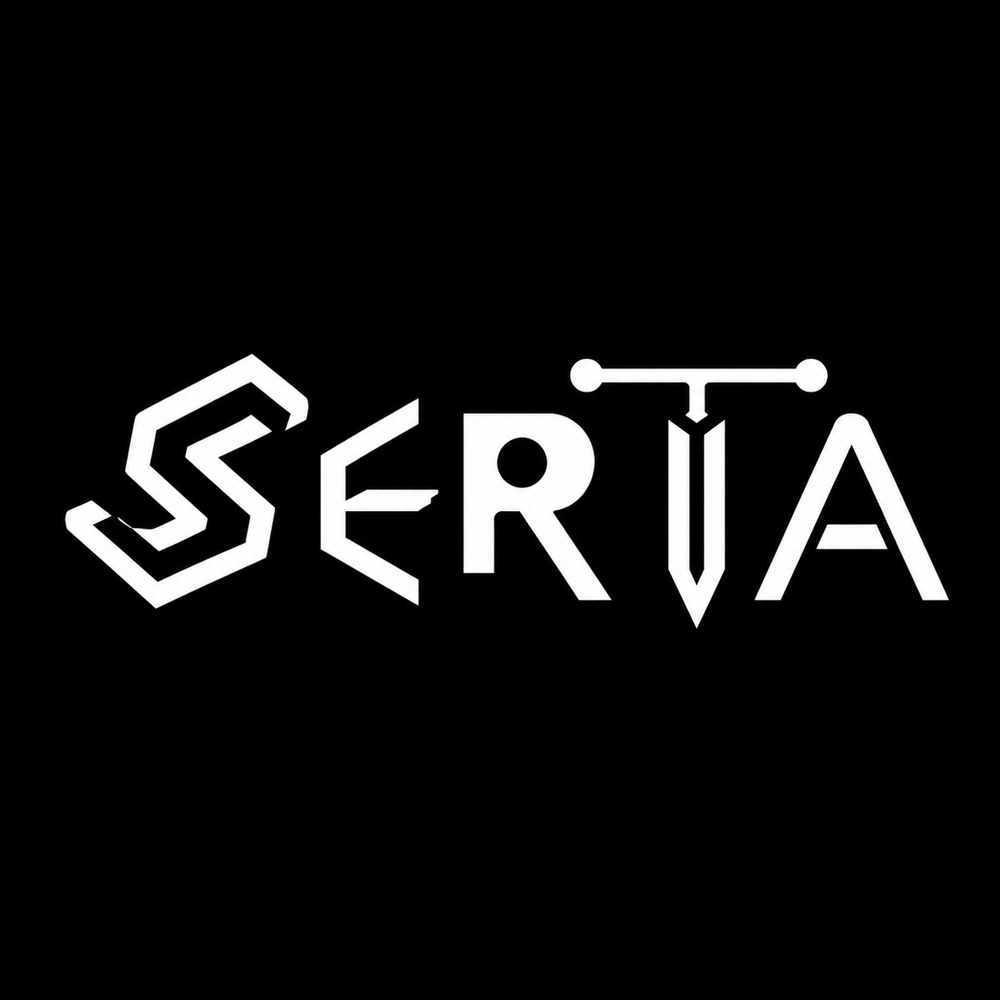

<div align="center">
  
</div>

<br/>

<div align="center">

[](https://www.python.org/)
[](https://flask.palletsprojects.com/)
[](#license)
[](#)

</div>

---

## What is Serta?
---
Serta is a Python CLI tool that spins up production-ready servers in seconds . Pick a server type, answer a few prompts, and you have a running Flask instance with an admin panel, file management, Cloudflare tunnel support, and bot hosting baked in.
---

## Features

### 🌐 Web Server
Host static sites or any folder as a live web server. Includes an admin panel, file upload widget (individual files, full folder trees, or ZIP archives), and optional Cloudflare tunnel for instant public URLs.

### 📦 File Storage Server
A self-hosted file cabinet. Upload, download, browse, and manage files through a clean web UI. Optional login protection keeps your data private.

### ☁ Cloudflare Tunnels
One-click public URLs via `cloudflared`. No port-forwarding, no router config. Works on any network.

### 🔐 Security
- PBKDF2-HMAC-SHA256 password hashing (260k iterations, per-project salt)
- CSRF token protection on all mutating endpoints
- Path-traversal guards on every file operation
- `secure_filename` enforcement on all uploads

---

## Requirements

- Python 3.8+
- Internet connection (for tunnel support and auto-installing dependencies)

Flask, Flask-SQLAlchemy, and Werkzeug are installed automatically on first run if they are missing.

---

## Quickstart

```bash
# Clone or download main.py, then:
python main.py
```

Serta walks you through everything interactively:

```
1. Run startup checks (Python version, network, Flask)
2. Create a new project or load an existing one
3. Choose a server type: Web · Storage · Bot
4. Set a port and admin password
5. Server starts — admin panel at http://127.0.0.1:<port>/admin
```

---

## Project Structure

Projects are stored under `~/.serta_projects/` and are fully self-contained:

```
~/.serta_projects/
└── my-project/
    ├── usb_config.json   ← project config (port, type, hashed password, etc.)
    ├── README.md         ← auto-generated per-project readme
    ├── site/             ← web server: hosted files (web type)
    ├── files/            ← storage server: uploaded files (storage type)
    └── bot/              ← bot hosting: uploaded script + logs (bot type)
```

---

## Server Types

### Web Server
| Route | Description |
|---|---|
| `/` | Serves the site directory |
| `/admin` | Admin panel — upload, manage, set hosted entry |
| `/admin/upload` | Multi-tab file uploader (Files · Folder · ZIP) |
| `/admin/tunnel` | Cloudflare tunnel management |

### Storage Server
| Route | Description |
|---|---|
| `/` | File browser |
| `/upload` | Upload files |
| `/download/<path>` | Download a file |
| `/admin` | Admin panel |
---

## Upload Modes

The admin upload widget supports three modes:

- **Files** — pick one or more individual files
- **Folder** — select an entire local folder; the directory tree is preserved server-side using `webkitRelativePath`
- **ZIP** — upload a `.zip` archive; Serta extracts it, strips the top-level wrapper folder (like GitHub zips have), and preserves the internal structure

---

## Configuration Reference

`usb_config.json` is written by Serta and lives inside each project directory. Key fields:
SERTA

<p align="center">
  
</p><p align="center">
  <b>Simple • Efficient • Reliable • Terminal Automation</b>
</p><p align="center">
  A lightweight server management and automation platform built with Python.
</p>---

✨ Features

- 🚀 Fast and lightweight
- 📁 File & folder management
- 🌐 Web hosting support
- 🤖 Bot hosting capabilities
- 💾 Storage management
- 🔒 Secure authentication utilities
- 📊 Logging and monitoring
- 🐍 Python-based and easy to customize
- 🌍 Cross-platform support

---

📦 Installation

Android (Termux)

pkg update -y
pkg upgrade -y

pkg install python git -y

git clone https://github.com/Kaztral-ar/serta.git
cd serta

python -m venv venv
source venv/bin/activate

python main.py

---

🚀 Quick Start

Run SERTA:

python main.py

---

📁 Project Structure

serta/
├── main.py
├── uploads/
├── logs/
├── static/
├── templates/
├── database/
└── README.md

---

⚙️ Requirements

- Python 3.10+
- Git
- Linux / Android (Termux) / Windows / macOS

---

🔧 Virtual Environment

Create a virtual environment:

python -m venv venv
source venv/bin/activate

Deactivate when finished:

deactivate

---

🛠️ Development

Clone the repository:

git clone https://github.com/Kaztral-ar/serta.git
cd serta

---

🤝 Contributing

Contributions, bug reports, and feature requests are welcome.

1. Fork the repository
2. Create a feature branch
3. Commit your changes
4. Open a Pull Request

---

📜 License

This project is licensed under the MIT License.

---

👨‍💻 Author

Gokul AR

GitHub: https://github.com/Kaztral-ar

---

<p align="center">
  Made with ❤️ using Python
</p>
